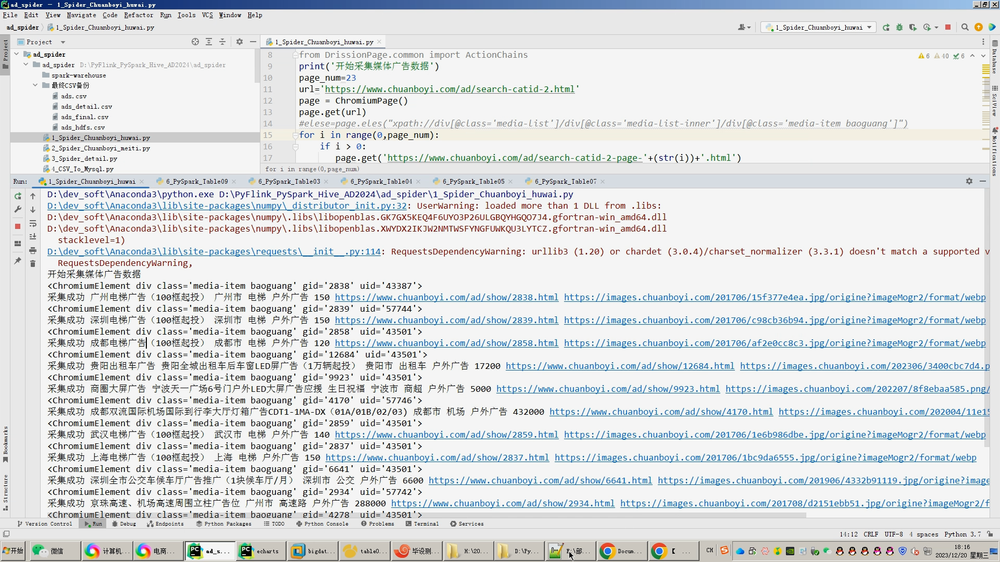
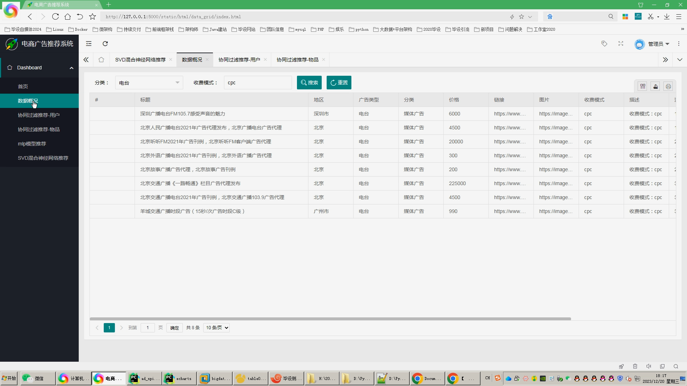
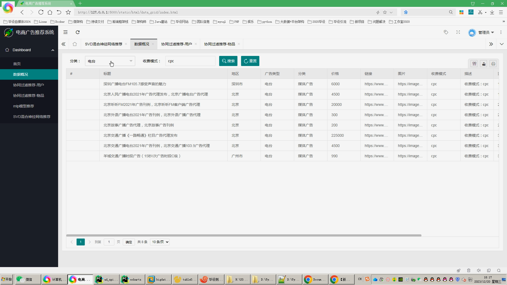
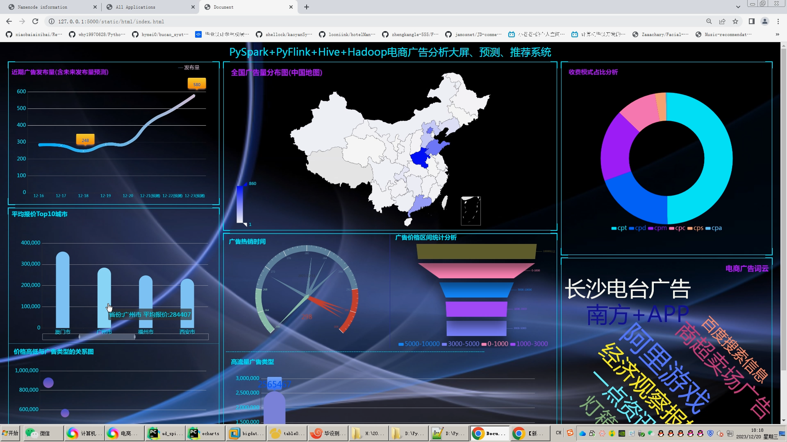
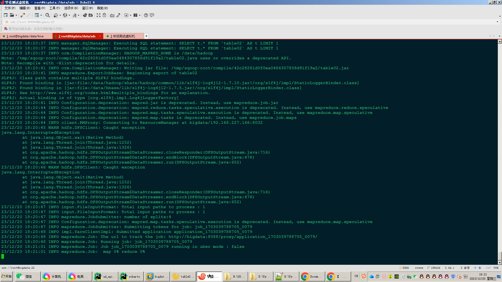
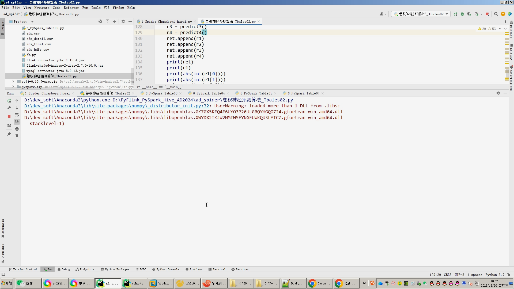
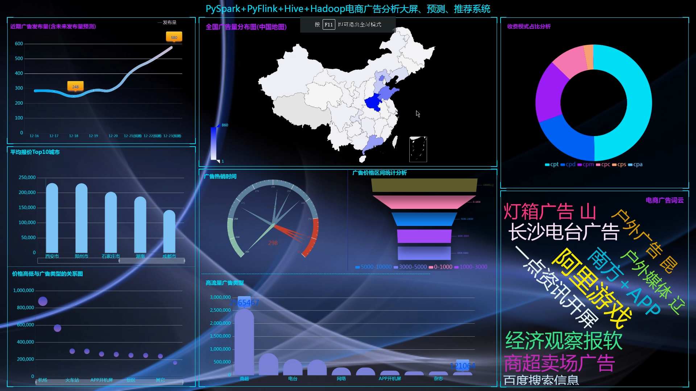

## 计算机毕业设计Hadoop+Hive+Spark+Flink广告推荐系统 广告预测 广告数据分析可视化 广告爬虫 大数据毕业设计 深度学习 机器学习

## 要求
### 源码有偿！一套(论文 PPT 源码+sql脚本+教程)

### 
### 加好友前帮忙start一下，并备注github有偿虚拟机广告推荐
### 我的QQ号是2827724252或者798059319或者 1679232425或者微信:bysj2023nb 或bysj1688

# 

### 加qq好友说明（被部分 网友整得心力交瘁）：
    1.加好友务必按照格式备注
    2.避免浪费各自的时间！
    3.当“客服”不容易，repo 主是体面人，不爆粗，性格好，文明人。
## 演示介绍
****

```
1.采集广告数据约100万条存入.csv和mysql,清洗后的.csv上传mysql;
3.分析指标离线可选用Hive,实时可选装PySpark/PyFlink,可三选一也可以只选一种或者三个都选；
4.计算结果使用sqoop工具对接到mysql数据库的指标表；
5.使用flask+echarts制作可视化大屏、layui查询表格；
6.使用卷积神经网络KNN CNN RNN对广告数据进行预测；
7.使用协同过滤算法基于用户、物品、MLP模型、混合神经网络SVD进行广告推荐；
创新点：全新DrssionPage爬虫框架、可视化大屏、离线计算实时计算全部实现、深度学习算法广告预测、4种广告推荐算法
```


## 演示视频
https://www.bilibili.com/video/BV1v4421w7z5/

## 演示截图










